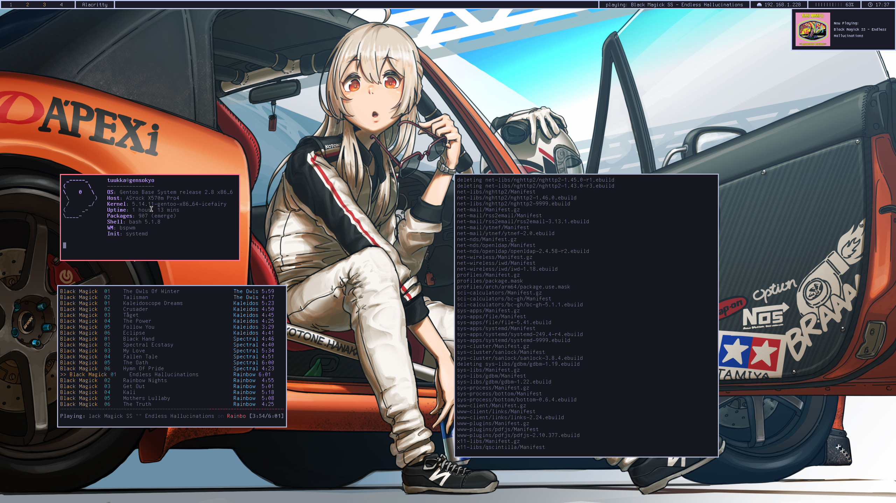

# Dotfiles
public repository for my dotfiles, at least most of them.

## Depencies
* Individual scripts such as [mpd notify](https://github.com/cirkku/mpd-notify) have individual depencies of their own.
* mpd uses yt-dlp instead of youtube-dl because of youtube-dl having abysmal speeds.
* GNU Stow is recommended for managing the dotfiles.

## general info
* window manager: bspwm
* bar: polybar
* music player: mpd with ncmpcpp 
* file manager: ranger
* video player: mpv
* notifications: dunst
* terminal emulator: alacritty
* color theme: tokyo night
* distro: gentoo (if you want to mimick my dotfiles as perfectly as possible remember to install gentoo with systemd)

## Usage with stow
1. Clone the dots with `git clone https://github.com/cirkku/dotfiles` optionally adding the output path as an argument to the end.
2. Make sure your old configuration files are either moved from their original locations or completely deleted.
3. `cd` into the directory you cloned the repository into.
4. My dotfiles are for my system so you should make sure that the configurations have correct paths for your system, for example scripts and configs managing mpd assume your music is located at `~/Mount/3TBHDD/Music`.
5. Run `stow -S */` to symlink/install my dots.

## Image

  

